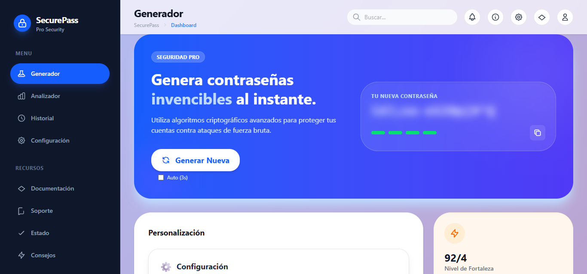
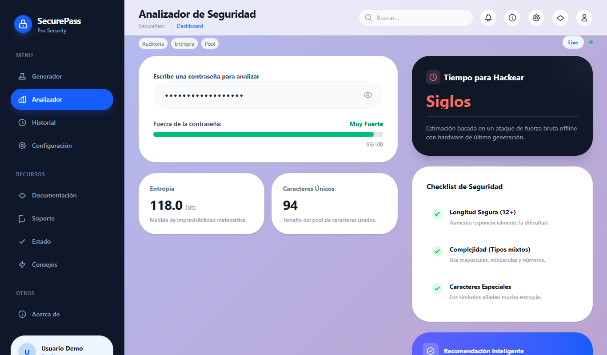
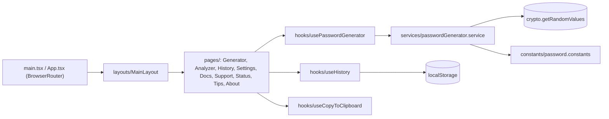

<div align="center">
  
  <h1>SecurePass</h1>
  <p><b>Generador y analizador de contraseñas que corre 100 % en el navegador, sin servidor ni base de datos.</b></p>
  
  
  
  
  
  
  <p>
    <a href="#-inicio-rápido">Inicio rápido</a> ·
    <a href="#-características">Características</a> ·
    <a href="#-arquitectura">Arquitectura</a> ·
    <a href="#-pruebas">Pruebas</a> ·
    <a href="#-lo-que-todavía-no-existe">Limitaciones</a>
  </p>
</div>

**SecurePass** es una aplicación de una sola página (React + Vite) que genera contraseñas aleatorias con la API criptográfica del navegador (`crypto.getRandomValues`), mide su fortaleza y guarda un historial local. Todo ocurre en el cliente: no hay backend ni cuentas. **No es** un gestor de contraseñas: no cifra ni protege lo que guarda y su historial es solo una comodidad de desarrollo (ver [Seguridad](#-seguridad)).

## 🎬 Vista rápida

Capturas reales de la aplicación local (la contraseña generada se desenfocó a propósito):

| Generador | Analizador |
| :---: | :---: |
|  |  |

## ✨ Características

| Característica | Detalle |
| :--- | :--- |
| 🎲 Generador | Longitud de 8 a 32 caracteres (16 por defecto); mayúsculas, minúsculas, números, símbolos y espacios opcionales. |
| 🔤 Opciones extra | Excluir caracteres parecidos (`I l 1 O 0`), evitar secuencias obvias (`123`, `abc`…) y garantizar al menos un carácter de cada tipo elegido. |
| ⏱️ Auto-generación | Casilla "Auto (3s)" que regenera la contraseña cada 3 segundos. |
| 📏 Medidor de fortaleza | Puntuación heurística 0-100 (longitud, variedad y penalizaciones por repeticiones y patrones) con cuatro niveles. |
| 🔍 Analizador | Escribe una cadena y obtiene fortaleza, entropía estimada en bits, tamaño del alfabeto usado, checklist y un tiempo estimado de fuerza bruta (a 10 000 millones de intentos/s). |
| 🕘 Historial | Guarda hasta 50 contraseñas generadas en `localStorage`, con búsqueda, filtro por fortaleza, borrado y exportación a CSV. |
| 📋 Copiar | Copia con un clic; opcionalmente vacía el portapapeles a los 30 s (ajuste "clipboardAutoClear"). |
| 🧭 Páginas | Generador, Analizador, Historial, Configuración, Documentación, Soporte, Estado, Consejos y Acerca de, con enrutado por `react-router-dom`. |

## 🏗️ Arquitectura

SPA sin backend. El generador es una función pura que usa `crypto.getRandomValues`; las páginas la consumen a través de un hook, y el historial y los ajustes viven en `localStorage`.



<details>
<summary>Estructura de carpetas</summary>

```text
src/
  pages/        una página por ruta
  components/   layout/, password/ (opciones, medidor, historial reciente), ui/
  hooks/        usePasswordGenerator, useHistory, useCopyToClipboard
  services/     passwordGenerator.service.ts (generación y fortaleza)
  constants/    límites, alfabetos, umbrales
  types/        tipos de contraseña y opciones
  styles/       tema, animaciones y componentes en CSS
  configuracion/, logica/, tipos/, utilidades/   capa alternativa en español (ver Limitaciones)
docs/           notas de reorganización y de arranque
```

</details>

## 🚀 Inicio rápido

| Requisito | Detalle |
| :--- | :--- |
| Node.js y npm | Versión reciente; se verificó con Node 24 y `npm ci` |

```bash
git clone https://github.com/Luiss2080/SecurePass.git
cd SecurePass
npm ci
npm run dev        # servidor de desarrollo de Vite (por defecto http://localhost:5173)
npm run build      # tsc + vite build, genera dist/
npm run preview    # sirve el build
```

`npm run build` compila sin errores (verificado al reescribir este README). No hay variables de entorno.

## 🧪 Pruebas

**No hay pruebas automatizadas ni CI.** La única verificación disponible es `npm run build`, que ejecuta `tsc` y `vite build`. La lógica de generación y de fortaleza (`services/passwordGenerator.service.ts`) sería el primer candidato a tener tests.

## 🔒 Seguridad

Lo que sí hace el código:

- Genera con `crypto.getRandomValues`, no con `Math.random`.
- No envía nada por red: no hay llamadas a APIs propias ni de terceros para las contraseñas.

Lo que debes saber:

- **El historial guarda las contraseñas en texto plano** en `localStorage` (clave `securepass_history`) y el botón "Exportar CSV" las escribe sin cifrar. Cualquiera con acceso al navegador o a un script en ese origen puede leerlas. Bórralo desde la página Historial si generas contraseñas reales.
- La página de Generador guarda **cada** contraseña generada en ese historial automáticamente.
- Cada carácter se elige con `valor % longitud_del_alfabeto`, lo que introduce un sesgo de módulo muy pequeño (no es una selección perfectamente uniforme).
- La "entropía" y el "tiempo para hackear" son estimaciones que asumen una cadena totalmente aleatoria: sobrevaloran frases o palabras predecibles.

## 🚧 Lo que todavía no existe

- Sin pruebas automatizadas ni CI.
- En **Configuración**, solo "vaciar portapapeles" tiene efecto. Los ajustes de *modo oscuro*, *copia automática* y *notificaciones* se guardan en `localStorage` pero ningún otro código los lee: hoy no cambian nada.
- Las carpetas `src/configuracion`, `src/logica`, `src/tipos` y `src/utilidades` (una reorganización en español) **no se importan desde la aplicación**; la app usa `constants/`, `services/` y `types/`. Están duplicadas y sin usar.
- No hay cifrado del historial, sincronización ni exportación segura; no es un gestor de contraseñas.
- No hay despliegue publicado; `docs/` contiene notas internas de reorganización, no una guía de despliegue.

## 📄 Licencia

Sin licencia definida: todos los derechos reservados por defecto.

<div align="center">
  <sub>Hecho por Luiss2080 · Generador de contraseñas del lado del cliente</sub>
</div>
